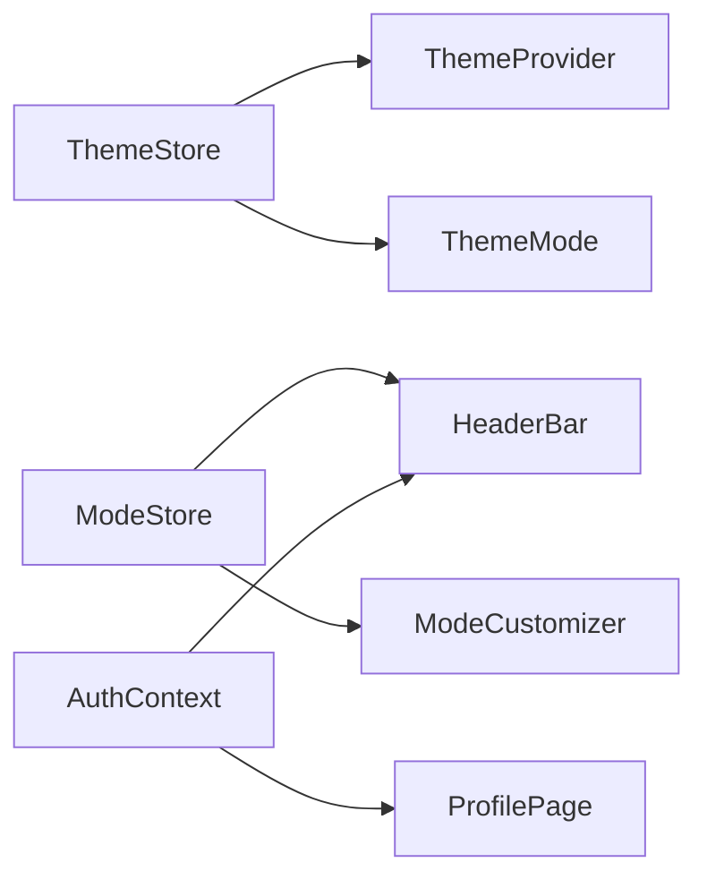

# GenieAgent TODO List

## Current Development Phase: Mock Data Implementation

### Dependencies

- [x] React
- [x] TypeScript
- [x] Tailwind CSS
- [x] Zustand (State Management)
- [x] Lucide React (Icons)
- [ ] Supabase (To be implemented)
- [x] @supabase/supabase-js
- [x] @types/node

### Authentication Tasks

- [x] Set up authentication types
- [x] Create authentication store
- [x] Implement login/signup UI
- [x] Create AuthProvider component
- [x] Set up Supabase authentication
  - [x] Create Supabase project
  - [x] Configure authentication providers
  - [x] Add Google authentication
  - [x] Set up email templates
  - [x] Add proper error handling

### Database Tasks

- [x] Set up Supabase database tables
  - [x] profiles
    ```sql
    create table profiles (
      id uuid references auth.users primary key,
      full_name text,
      avatar_url text,
      email text,
      created_at timestamp with time zone,
      updated_at timestamp with time zone
    );
    ```
  - [x] agents
  - [x] workflows
  - [x] knowledge_bases
  - [x] documents
  - [x] Set up RLS (Row Level Security) policies

### Mock Data Implementation

- [x] Create mock data store
  - [x] Mock user data
  - [x] Mock agent data
  - [x] Mock workflow data
  - [x] Mock knowledge base data
- [x] Implement mock data services
  - [x] Authentication service
  - [x] User service
  - [x] Agent service
  - [x] Workflow service
  - [x] Knowledge base service

### UI Components

- [x] Sidebar navigation
- [x] Authentication forms
- [x] Main content layout
- [x] Workflow builder
- [x] Profile management
- [x] Settings panel
- [x] Knowledge base interface
- [x] Document upload/management

### Migration to Supabase

- [x] Set up Supabase project
- [x] Configure environment variables
- [x] Migrate mock data to Supabase
- [x] Update services to use Supabase client
- [x] Implement proper error handling
- [x] Add data validation

### Recent Updates (March 2025)

- [x] Fixed chat functionality in RightSidebar.tsx
- [x] Removed redundant "New Chat" button from HeaderBar.tsx
- [x] Implemented user profile page with editing capabilities
- [x] Enhanced user menu with proper authentication integration
- [x] Configured Google authentication
- [x] Fixed chat display and scrolling behavior
- [x] Added file storage for user avatars

### Next Steps

- [x] Implement Prompt Manager with tagging and favorites
- [x] Implement email verification flow
- [x] Add password reset functionality
- [ ] Create admin panel for user management
- [ ] Add analytics dashboard
- [ ] Implement real-time collaboration features
- [ ] Add export/import functionality for user data
- [ ] Optimize performance for large datasets
- [ ] Implement comprehensive test suite
- [x] Implement subscription management system
  - [x] Set up Stripe integration
  - [x] Create subscription plans and pricing page
  - [x] Add premium feature access control
  - [x] Add usage tracking and limits
- [ ] Add AI model selection and API key management
- [ ] Implement knowledge base integration with document processing
- [ ] Add workflow templates and sharing functionality
- [ ] Implement user onboarding flow with tutorials
- [ ] Add notification system for updates and alerts

# GenieAgent Application Structure

## 1. Core Components
/src
├── components/
│   ├── layout/
│   │   └── HeaderBar.tsx (Main navigation and controls)
│   ├── theme/
│   │   ├── ThemeControls.tsx (Theme settings container)
│   │   ├── ThemeMode.tsx (Theme mode and color controls)
│   │   └── ThemeProvider.tsx (Theme context provider)
│   ├── mode/
│   │   └── ModeCustomizer.tsx (Assistant mode customization)
│   └── ui/
│       └── button.tsx (Shared UI components)

## 2. State Management
/src/stores/
├── theme/
│   └── themeStore.ts (Theme state management)
└── model/
    └── modeStore.ts (Assistant mode state management)

## 3. Features & Functionality

### 3.1 Theme System
- Mode Selection (Light/Dark/System)
- Color Profiles
  - Default
  - Vibrant
  - Muted
  - High Contrast
- Color Intensity Control
- Auto-save functionality

### 3.2 Assistant Modes
- Mode Selection
- Custom Mode Creation
- Mode Customization
  - Name
  - Description
  - System Prompt
  - Temperature
  - Custom Instructions

### 3.3 UI Components
- Header Navigation
- Theme Controls Panel
- Mode Selector Dropdown
- Mode Customizer Panel
- Fullscreen Toggle

### 3.4 Authentication & User Management
- Google OAuth Integration
- Email/Password Authentication
- User Profile Management
- Avatar Upload & Storage
- Profile Editing
- Session Management

## 4. Key Features
- Persistent Settings
- System Theme Detection
- Real-time Theme Updates
- Customizable Assistant Modes
- Responsive Layout
- Secure Authentication
- User Profile Management
- File Storage Integration

## 5. Component Hierarchy
```mermaid
graph TD
    App --> AuthProvider
    AuthProvider --> MainLayout
    MainLayout --> HeaderBar
    HeaderBar --> ThemeControls
    HeaderBar --> ModeCustomizer
    ThemeControls --> ThemeMode
    App --> ThemeProvider
    ThemeProvider --> "*" [All Components]
```

## 6. State Flow


## 7. File Naming Conventions
- Components: PascalCase (e.g., ThemeMode.tsx)
- Stores: camelCase (e.g., themeStore.ts)
- Utilities: camelCase (e.g., utils.ts)

## 8. Import Conventions
- Absolute imports using '@/' prefix
- Component imports grouped by type
- Third-party imports listed first

## 9. Styling Approach
- Tailwind CSS for styling
- CSS variables for theme values
- Consistent class naming
- Responsive design patterns
