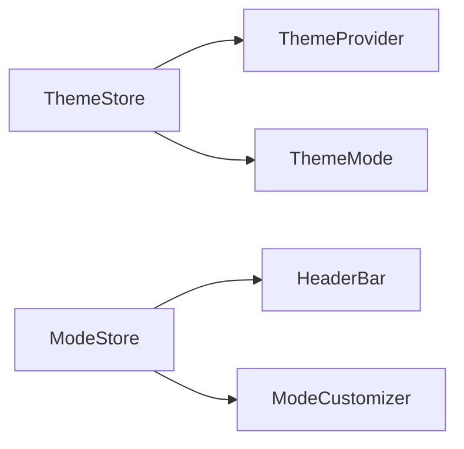

# GenieAgent TODO List

## Current Development Phase: Mock Data Implementation

### Dependencies

- [x] React
- [x] TypeScript
- [x] Tailwind CSS
- [x] Zustand (State Management)
- [x] Lucide React (Icons)
- [ ] Supabase (To be implemented)
- [ ] @supabase/supabase-js
- [ ] @types/node

### Authentication Tasks

- [x] Set up authentication types
- [x] Create authentication store
- [x] Implement login/signup UI
- [x] Create AuthProvider component
- [ ] Set up Supabase authentication
  - [ ] Create Supabase project
  - [ ] Configure authentication providers
  - [ ] Set up email templates
  - [ ] Add proper error handling

### Database Tasks

- [ ] Set up Supabase database tables
  - [ ] profiles
    ```sql
    create table profiles (
      id uuid references auth.users primary key,
      full_name text,
      avatar_url text,
      email text,
      created_at timestamp with time zone,
      updated_at timestamp with time zone
    );
    ```
  - [ ] agents
  - [ ] workflows
  - [ ] knowledge_bases
  - [ ] documents
  - [ ] Set up RLS (Row Level Security) policies

### Mock Data Implementation

- [ ] Create mock data store
  - [ ] Mock user data
  - [ ] Mock agent data
  - [ ] Mock workflow data
  - [ ] Mock knowledge base data
- [ ] Implement mock data services
  - [ ] Authentication service
  - [ ] User service
  - [ ] Agent service
  - [ ] Workflow service
  - [ ] Knowledge base service

### UI Components

- [x] Sidebar navigation
- [x] Authentication forms
- [x] Main content layout
- [x] Workflow builder
- [ ] Profile management
- [ ] Settings panel
- [ ] Knowledge base interface
- [ ] Document upload/management

### Future Enhancements

- [ ] Real-time collaboration
- [ ] Advanced workflow templates
- [ ] AI model integration
- [ ] Export/import functionality
- [ ] Analytics dashboard
- [ ] Team collaboration features

### Migration to Supabase

- [ ] Set up Supabase project
- [ ] Configure environment variables
- [ ] Migrate mock data to Supabase
- [ ] Update services to use Supabase client
- [ ] Implement proper error handling
- [ ] Add data validation
- [ ] Set up backup procedures

# GenieAgent Application Structure

## 1. Core Components
/src
├── components/
│   ├── layout/
│   │   └── HeaderBar.tsx (Main navigation and controls)
│   ├── theme/
│   │   ├── ThemeControls.tsx (Theme settings container)
│   │   ├── ThemeMode.tsx (Theme mode and color controls)
│   │   └── ThemeProvider.tsx (Theme context provider)
│   ├── mode/
│   │   └── ModeCustomizer.tsx (Assistant mode customization)
│   └── ui/
│       └── button.tsx (Shared UI components)

## 2. State Management
/src/stores/
├── theme/
│   └── themeStore.ts (Theme state management)
└── model/
    └── modeStore.ts (Assistant mode state management)

## 3. Features & Functionality

### 3.1 Theme System
- Mode Selection (Light/Dark/System)
- Color Profiles
  - Default
  - Vibrant
  - Muted
  - High Contrast
- Color Intensity Control
- Auto-save functionality

### 3.2 Assistant Modes
- Mode Selection
- Custom Mode Creation
- Mode Customization
  - Name
  - Description
  - System Prompt
  - Temperature
  - Custom Instructions

### 3.3 UI Components
- Header Navigation
- Theme Controls Panel
- Mode Selector Dropdown
- Mode Customizer Panel
- Fullscreen Toggle

## 4. Key Features
- Persistent Settings
- System Theme Detection
- Real-time Theme Updates
- Customizable Assistant Modes
- Responsive Layout

## 5. Component Hierarchy
```mermaid
graph TD
    App --> HeaderBar
    HeaderBar --> ThemeControls
    HeaderBar --> ModeCustomizer
    ThemeControls --> ThemeMode
    App --> ThemeProvider
    ThemeProvider --> "*" [All Components]
```

## 6. State Flow


## 7. File Naming Conventions
- Components: PascalCase (e.g., ThemeMode.tsx)
- Stores: camelCase (e.g., themeStore.ts)
- Utilities: camelCase (e.g., utils.ts)

## 8. Import Conventions
- Absolute imports using '@/' prefix
- Component imports grouped by type
- Third-party imports listed first

## 9. Styling Approach
- Tailwind CSS for styling
- CSS variables for theme values
- Consistent class naming
- Responsive design patterns
